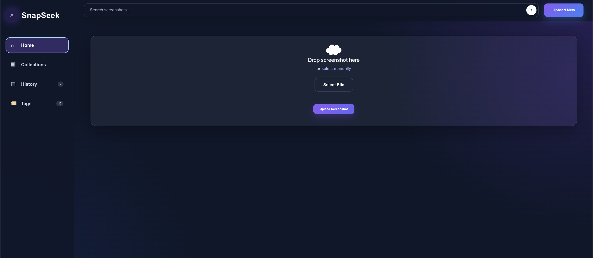
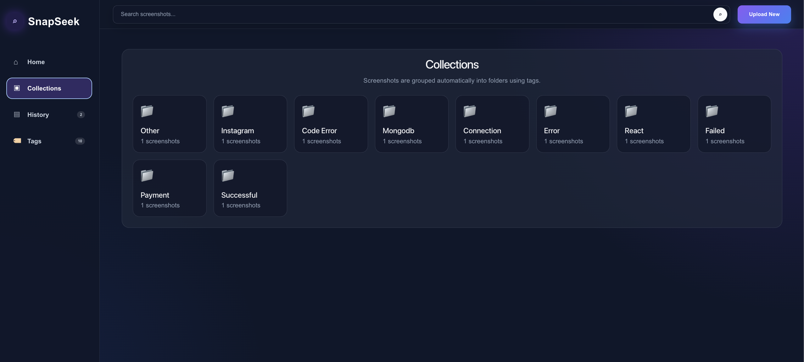
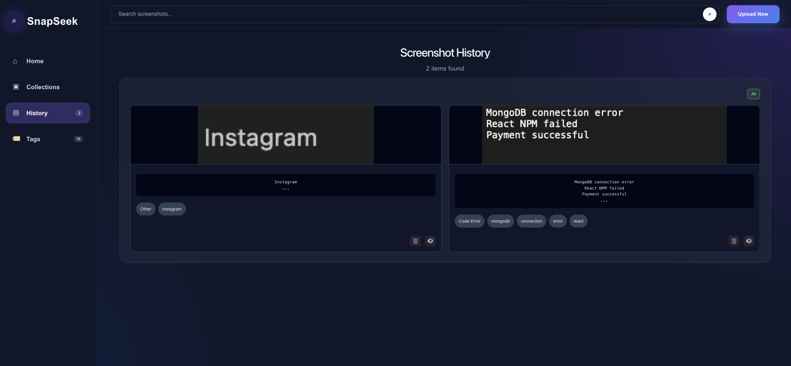
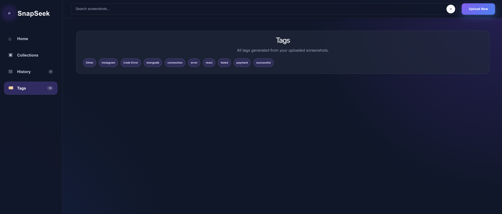

# SnapSeek

SnapSeek is a full-stack OCR-based screenshot search engine that helps users upload screenshots, extract text from them, automatically generate tags, categorize screenshots, and search them later.

It is designed for people who save many screenshots of code errors, notes, payments, college work, or important information and then struggle to find them again.

---

## Project Overview

Screenshots often contain useful information, but normal image files are difficult to search because the text inside them is not searchable.

SnapSeek solves this problem by using OCR to extract text from uploaded screenshots and storing that extracted text along with the image. Users can then search screenshots using normal text queries, browse upload history, view tag-based collections, and manage saved screenshots.

---

## Features

### Core Features

- Upload screenshots from the browser
- Drag-and-drop screenshot upload
- Preview selected screenshot before uploading
- Extract text from screenshots using OCR
- Save extracted text and image details to MongoDB
- Search screenshots using extracted OCR text
- View screenshot upload history
- Delete saved screenshots
- Open uploaded screenshots in a new tab

### Smart Organization

- Automatic category detection
- Automatic tag generation from extracted text
- Tag-based collections
- Separate Tags page for viewing all generated tags
- Category filters in screenshot history
- Sensitive-content detection with safe/sensitive labels

### UI & UX

- Dashboard-style layout
- Sidebar navigation
- Search bar in navbar
- Home, Collections, History, and Tags sections
- Responsive dark-themed interface
- Folder-style collections based on tags

---

## Tech Stack

| Layer | Technology |
|---|---|
| Frontend | React, Vite, CSS |
| Backend | Node.js, Express.js |
| Database | MongoDB Atlas |
| OCR | Tesseract.js |
| File Upload | Multer |
| API Requests | Axios |

---

## Project Structure

```txt
snapseek/
├── client/
│   ├── src/
│   │   ├── App.jsx
│   │   ├── App.css
│   │   └── main.jsx
│   ├── package.json
│   └── .gitignore
│
├── server/
│   ├── models/
│   │   └── Screenshot.js
│   ├── routes/
│   │   └── screenshotRoutes.js
│   ├── uploads/
│   ├── server.js
│   ├── package.json
│   ├── .env
│   └── .gitignore
│
└── README.md
```

---

## Installation and Setup

### Prerequisites

Make sure you have the following installed:

- Node.js
- npm
- MongoDB Atlas account

---

## 1. Clone the Repository

```bash
git clone <your-repository-url>
cd snapseek
```

---

## 2. Backend Setup

Go to the server folder:

```bash
cd server
npm install
```

Create a `.env` file inside the `server` folder:

```env
PORT=8000
MONGO_URI=your_mongodb_atlas_connection_string
```

Start the backend server:

```bash
npm run dev
```

The backend will run on:

```txt
http://localhost:8000
```

---

## 3. Frontend Setup

Open another terminal and go to the client folder:

```bash
cd client
npm install
npm run dev
```

The frontend will run on:

```txt
http://localhost:5173
```

---

## API Routes

| Method | Route | Description |
|---|---|---|
| POST | `/api/screenshots/upload` | Upload screenshot, extract text, and save data |
| GET | `/api/screenshots/all` | Fetch all saved screenshots |
| GET | `/api/screenshots/search?q=text` | Search screenshots using extracted text |
| DELETE | `/api/screenshots/:id` | Delete a saved screenshot |

---

## Main Pages

### Home

The Home page contains the screenshot upload area, file preview, and latest OCR result.

### Collections

The Collections page groups screenshots automatically into folders based on generated tags. Clicking a folder shows all screenshots related to that tag.

### History

The History page shows all uploaded screenshots in order. It also includes category filters and actions to view or delete screenshots.

### Tags

The Tags page displays all generated tags from uploaded screenshots. It stores only tag names and does not display images.

---

## How It Works

1. User uploads or drops a screenshot.
2. The backend receives the image using Multer.
3. Tesseract.js extracts text from the uploaded image.
4. The extracted text is analyzed to generate tags and categories.
5. Screenshot metadata is saved in MongoDB.
6. User can search, filter, view, or delete screenshots later.

---

## Example Use Cases

- Search old coding error screenshots
- Store and find payment screenshots
- Organize college notes from screenshots
- Quickly find screenshots by keywords
- Automatically group screenshots using tags
- Keep a searchable personal screenshot library

---

## Screenshots

### Home Page


### Collections Page


### History Page


### Tags Page


---

## Future Improvements

- User authentication
- Cloud image storage
- Better AI-based categorization
- Date-based filters
- Export OCR text as TXT or PDF
- Highlight searched words inside OCR results
- Folder creation by user
- Multi-image upload support
- Advanced search with category and tag filters

---

## Resume Description

Built SnapSeek, an OCR-powered screenshot search engine that extracts text from uploaded screenshots and makes them searchable.

Implemented drag-and-drop upload, OCR text extraction, automatic tag generation, category detection, sensitive-content detection, search, filters, tag-based collections, and MongoDB-backed screenshot history using React, Node.js, Express, MongoDB, Multer, Axios, and Tesseract.js.

---

## Author

**Siddharth Naryal**
